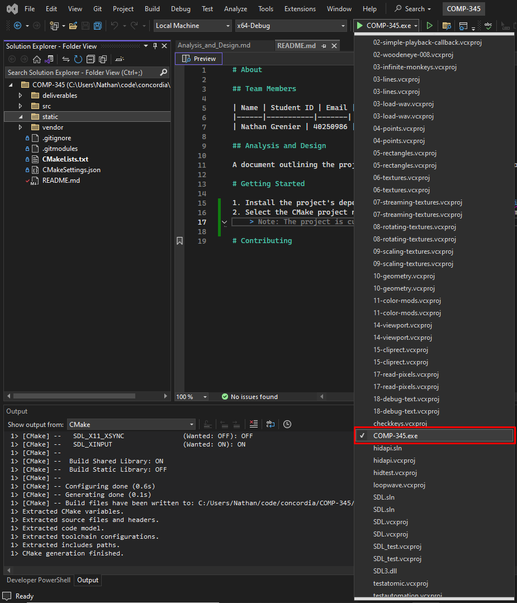
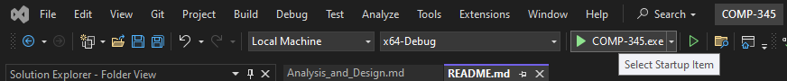

# About

## Team Members

| Name            | Student ID | Email                      |
| --------------- | ---------- | -------------------------- |
| Nathan Grenier  | 40250986   | nathangrenier01@gmail.com  |
| Denmar Ermitano | 40286029   | d_ermita@live.concordia.ca |
| Nirav Patel     | 40248940   | pa_nir@live.concordia.ca   |

## Analysis and Design

A document outlining the project's analysis and design considerations can be found at: [`deliverables/Analysis_and_Design.md`](deliverables/Analysis_and_Design.md).

## Assignment Documentation

All assignment documentation can be found in the [`deliverables/`](deliverables/) directory. There will be a markdown file for each assignment.

## Project Documentation

The project's documentation can be found online here: https://comp345.ngrenier.com/

The [project's documentation](docs/html/index.html), generated using Doxygen, can be viewed in any web browser. It can also be [viewed as a PDF](docs/latex/refman.pdf).

# Getting Started

> Note: The project was tested an ran on VisualStudio v17.3.6+

1. Install the project's dependencies by running `git submodule init` followed by `git submodule update --init --recursive`.
   > If you don't have git installed. You can use the installation .exe in `vendor/`.
2. Select the CMake project name as the startup to execute.
<div align="center">
	
</div>
3. Compile and run the project by click the green arrow.
<div align="center">
	
</div>

# Contributing

## Doxygen Comments

In order to generate Doxygen documentation, you must first install the software. Follow this guide (just the installation): https://darkognu.eu/programming/tutorials/doxygen_tutorial_cpp

To generate the documentation, run the following command in the workspace root directory:

```bash
doxygen
```

To view the generated documentation, open the <a href="docs/html/index.html" target="_blank">`docs/html/index.html`</a> file in a web browser.

### Compile Doxygen Documentation to PDF

1. Run the following command (with latex installed): `docs/latex/make.bat`

You can now view the generated PDF at [`docs/latex/refman.pdf`](docs/latex/refman.pdf).
